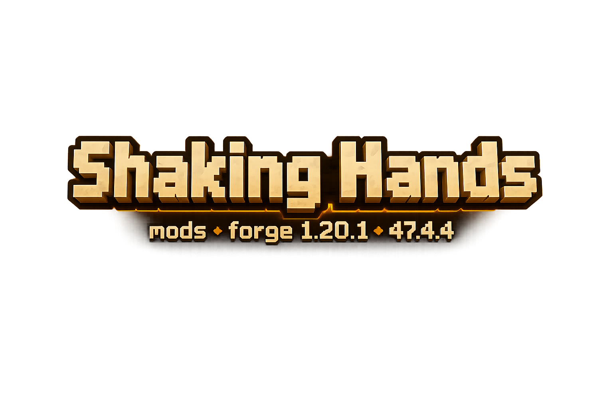

<div align="center">



### Кооперативный мод для Minecraft Forge 1.20.1

Хлопки, рукопожатия, dap-комбо, хай-файвы, объятия, захваты, броски, пинки, ловля друзей, огненные комбо, метеоры и дружеский хаос с кинематографичными эффектами.

[](https://www.minecraft.net/)
[](https://files.minecraftforge.net/)
[](LICENSE)
[](https://github.com/IlyshkaColeman/Shaking-hands-forge-1.20.1-47.4.4)

<br>

[](https://github.com/IlyshkaColeman/Shaking-hands-forge-1.20.1-47.4.4/releases)
[](https://modrinth.com/mod/shaking-hands)
[](https://boosty.to/coleman)

</div>

---

## ✨ Что это за мод?

**Shaking Hands** — это Forge 1.20.1 порт и развитие идеи оригинального мода **Dap ur Homies**. Мод добавляет в Minecraft живые кооперативные механики для игры с друзьями: не просто анимации, а полноценные взаимодействия, комбо, тайминги, эффекты, звуки и HUD.

Здесь можно:

- поднять руку и дать другу хай-файв;
- зарядить dap вместе с напарником;
- промахнуться по таймингу и получить кулдаун;
- схватить игрока и бросить его;
- использовать друга как живой щит;
- поймать падающего игрока;
- зарядить вулканический Fire Dap;
- запустить Fusion, Divine Flame Combo и Meteor Strike;
- обняться после хай-файва, потому что дружба — это тоже механика.

Мод лучше всего раскрывается на сервере или в LAN-игре, когда несколько игроков одновременно экспериментируют с комбо.

---

## ⬇ Скачать

Скачивайте мод только со страницы **GitHub Releases**:

👉 **[Скачать Shaking Hands](https://github.com/IlyshkaColeman/Shaking-hands-forge-1.20.1-47.4.4/releases)**

Файл релиза должен называться так:

```text
Shaking-hands-forge-1.20.1-47.4.4.jar
```

Поместите jar-файл в папку `mods` вместе с обязательными зависимостями.

---

## ☕ Поддержать автора

Если мод подарил вам смешной момент на сервере или вы хотите помочь развитию проекта, можно поддержать автора на Boosty:

<div align="center">

[](https://boosty.to/coleman)

</div>

Поддержка не обязательна, но очень помогает: на тесты, полировку механик, новые анимации, звуки, HUD и комбо. Если не хотите донатить, тоже всё нормально — звезда репозиторию, багрепорт или рассказ о моде друзьям тоже сильно помогают.

Подробнее: [SUPPORT.md](docs/SUPPORT.md).

---

## ✅ Обязательные моды

Для работы анимаций нужны дополнительные библиотеки.

| Что нужно | Версия |
|---|---|
| Minecraft Forge | `1.20.1 - 47.4.4` |
| Player Animation Lib Forge | `player-animation-lib-forge-1.0.2-rc1+1.20` |
| Bendy Lib Forge | `bendy-lib-forge-4.0.0` |

На сервере и у всех игроков должны быть установлены одинаковые версии мода и зависимостей.

---

## 🛡 Безопасность и доверие

Проект открыт: исходный код можно посмотреть, скачать и собрать самостоятельно.

Мод:

- не содержит установщика;
- не просит данные от аккаунта Minecraft;
- не требует пароли, токены или доступ к браузеру;
- не скачивает скрытые `.exe`-файлы во время игры;
- собирается из исходного кода этого репозитория.

Для дополнительной проверки у релиза указан SHA-256 хэш jar-файла. Игрок может сверить хэш скачанного файла и убедиться, что jar не был подменён.

---

## 🎮 Управление по умолчанию

| Кнопка / действие | Механика |
|---|---|
| `G` | Sync Dap с горизонтальной timing-шкалой / QTE / Meteor / обычный dap при отсутствии партнёра |
| `Shift + G` | Классический charged dap |
| `H` | High Five |
| `ПКМ + H` | Sike — обманный хай-файв |
| `J` | Fire Dap / Divine Flame Combo |
| `F` | Hug / Huddle |
| `R` | Grab ready / ловля падающего игрока / отпустить удерживаемого игрока |
| `T` | Заряд броска, если держишь игрока / пинок, если руки пустые |
| `V` | Переключить живой щит / хлопок, если руки пустые |
| `Shift + ПКМ` | Push — толчок игрока |
| `Shift` в воздухе после броска | Spin / Ground Pound flow |
| `/sit` | Сесть |

Для большинства механик нужна пустая основная рука.

---

## 🧩 Все комбо и цепочки

Большая часть комбо рассчитана на игру с другом: стойте рядом, держите пустую основную руку и следите за подсказками на HUD. В Sync Dap оба игрока отпускают `G` на горизонтальной шкале и должны попасть в одинаковую цветную зону.

| Комбо | Как выполнить | Что происходит |
|---|---|---|
| **High Five** | Оба игрока рядом жмут `H` | Обычный хай-файв; сила зависит от скорости перед хлопком |
| **High Five Combo** | После успешного хай-файва оба быстро жмут `H` ещё раз | Второй усиленный удар, заморозка на месте и эффектный взрыв частиц |
| **Sike** | Зажать `ПКМ` и нажать `H` | Обманный хай-файв: жертва получает оглушение и замедление |
| **Mutual Sike** | Оба игрока одновременно делают `ПКМ + H` | Обоих отбрасывает, срабатывает наказание за двойную обманку |
| **Sync Dap: серая зона** | Один или оба игрока отпускают `G` на серой части шкалы | Провал: звук промаха и надпись `The loser failed` |
| **Sync Dap: жёлтая зона** | Оба отпускают `G` на жёлтой части шкалы | Обычный чистый хлопок |
| **Sync Dap: зелёная зона** | Оба отпускают `G` на зелёной части шкалы | Сильный хлопок с усиленным эффектом |
| **Sync Dap: красный центр** | Оба попадают в красную центральную линию | Самый сильный хлопок, impact-кадры, шейдерный эффект и переход в G-комбо |
| **Great Dap → QTE** | После мощного хлопка нажимать `G` / `H` по подсказкам | Запускается QTE-цепочка, которая усиливает эффект при успешных нажатиях |
| **Triple Dap** | Три игрока почти одновременно делают dap рядом | Тройной dap на всех участников |
| **Facing Dap / Dap Loop** | При полном заряде оба подтверждают dap через `ПКМ` по партнёру | Зацикленная сцена dap с кинематографичными ударами |
| **Fire Dap** | Оба копят огонь полным зарядом в движении и делают dap | Огненный удар, красный overcharge HUD и окно для `J` / `G` продолжения |
| **Divine Flame Combo** | После Fire Dap оба жмут `J` в окне подсказки | Огненное торнадо, aura-beam, стены огня и мощный визуальный финал |
| **Dap Fusion** | После Fire Dap нажать `G` в окне fusion | Слияние игроков и QTE-цепочка с кнопками `G` / `H` |
| **Meteor Strike** | После успешного Fusion нажать `G`, когда HUD показывает `METEOR READY` | Метеор падает в точку взгляда игрока |
| **Heaven Dap** | Оба в статусе `HEAVEN READY`, высокая скорость и идеальный dap | Телепорт на высоту, полёт, белая вспышка и эффект Perfect Friendship |
| **Hug** | После хай-файва в окне нажать `F` или держать `F` рядом | Объятие, сближение, сердечки и приятный кооперативный эффект |
| **Huddle** | 2+ игрока держат `F`, затем проходят QTE `G` / `H` | Групповой круг; успех даёт баффы, провал откидывает участников |
| **Grab → Throw** | Один готовится через `R`, другой хватает, затем держит `T` | Заряженный бросок игрока с предпросмотром траектории |
| **Throw → Spin / Ground Pound** | Брошенный игрок в воздухе жмёт `Shift` | Вращение в воздухе и удар по земле после падения |
| **Human Shield** | Держишь игрока и жмёшь `V` | Переключение режима живого щита |
| **Catch** | Поднять руку через `R` рядом с падающим игроком | Ловля союзника и отмена урона от падения |
| **Kick / Drop-kick** | `T` с пустыми руками; для усиления — спринт и удержание | Пинок или мощный drop-kick по цели |
| **Clap Chain** | `V` с пустыми руками, повторять хлопки в тайминг | Серия хлопков с усиливающимся эффектом |

Полная шпаргалка с условиями, таймингами и причинами, почему комбо может не сработать: [COMBOS.md](docs/COMBOS.md).

---

## 🔥 Основные механики

### 🤝 Dap-система

Игроки держат `G`, ждут напарника и отпускают кнопку на горизонтальной шкале с бегущим ползунком. Результат зависит от того, в какую цветную зону попали оба игрока: серая — провал, жёлтая — обычный хлопок, зелёная — сильный хлопок, красная середина — самый мощный хлопок с продолжением в комбо.

Есть:

- горизонтальная шкала с зонами серый/жёлтый/зелёный/красный;
- Perfect Dap;
- кулдаун при промахе;
- Sync Dap, где оба игрока должны попасть в одну цветную зону;
- Triple Dap;
- Facing Dap;
- цепочка Perfect Combo;
- Fire Dap;
- Heaven Dap.

### 🔥 Fire Dap и Heaven

Если держать полный заряд и двигаться, начинает копиться огонь. HUD становится горячее, появляется тряска камеры и ощущение, что сейчас случится что-то очень плохое для мира вокруг.

На высоком заряде открываются:

- вулканический Fire Dap;
- Divine Flame Combo по `J`;
- Fusion по `G`;
- Heaven Dap с кинематографичными эффектами.

### ✋ High Five

Нажмите `H` с пустыми руками, чтобы поднять руку. Если рядом друг тоже поднимет руку — произойдёт хай-файв.

Есть:

- таймер ожидания;
- `LEFT HANGING`, если друг не ответил;
- тиры удара по скорости;
- Shockwave High Five;
- окно второго комбо-удара;
- Sike;
- Mutual Sike.

### 🫂 Hug и Huddle

После успешного хай-файва можно обняться. Группа игроков может собрать huddle и пройти QTE ради баффов.

Есть:

- окно объятия после хай-файва;
- hold-to-hug;
- присоединение к huddle;
- групповое QTE;
- баффы при успехе;
- отбрасывание при провале.

### 🏋 Grab, Throw и Human Shield

Поднимите руку через `R`, дайте другому игроку схватить вас и превратитесь в источник проблем.

Есть:

- поза готовности к захвату;
- перенос игрока;
- заряд броска;
- YEET;
- предпросмотр траектории;
- управление в полёте после броска;
- буст элитрами;
- режим живого щита.

### 🦶 Kick и Drop-kick

Кнопка `T` с пустыми руками:

- короткое нажатие — обычный пинок;
- удержание во время спринта — мощный drop-kick.

### 🧤 Catch

Поднимите руку рядом с падающим игроком, чтобы поймать его и отменить урон от падения.

### 👏 Clap

Кнопка `V` с пустыми руками делает хлопок. Повторные хлопки усиливают эффект.

### ☄ Fusion и Meteor

Fusion — большая dap-цепочка с QTE. После успешного Fusion игрок получает способность Meteor Strike.

---

## 🎨 Визуальный стиль

В Forge-порте добавлен собственный HUD для механик вместо скучных ванильных actionbar-сообщений:

- яркие заголовки;
- светящиеся панели;
- динамичные cooldown-тексты;
- эффекты блика;
- вулканический текст Fire Charge;
- тряска камеры при мощном заряде;
- cinematic impact frames;
- бело-чёрные силуэты на ударе.

---

## 🧪 Сборка из исходников

Нужно:

- Java 17;
- ForgeGradle;
- зависимости для анимаций, как указано в проекте.

Сборка:

```bash
./gradlew build
```

Windows:

```bat
gradlew.bat build
```

Готовый jar будет здесь:

```text
build/libs/Shaking-hands-forge-1.20.1-47.4.4.jar
```

---

## 📌 Статус проекта

Основные механики перенесены и проект успешно собирается. Перед большим публичным релизом всё равно рекомендуется прогнать полный тест на двух или более клиентах, потому что многие механики завязаны на мультиплеер, тайминги, сеть и анимации.

Полезные файлы:

- [CONTROLS_AND_MECHANICS.md](docs/CONTROLS_AND_MECHANICS.md) — подробное управление и механики;
- [COMBOS.md](docs/COMBOS.md) — заметки по комбо;
- [NEXT_STEPS.md](docs/NEXT_STEPS.md) — что ещё стоит доработать.

---

## 💬 Обратная связь

Нашли баг, странную анимацию или придумали новую механику? Создайте Issue:

- [сообщить о баге](https://github.com/IlyshkaColeman/Shaking-hands-forge-1.20.1-47.4.4/issues/new?template=bug_report.yml);
- [предложить идею](https://github.com/IlyshkaColeman/Shaking-hands-forge-1.20.1-47.4.4/issues/new?template=feature_request.yml).

Чем подробнее описание, тем проще исправить проблему: версия Forge, список модов, что нажимали, что ожидали увидеть и что произошло на самом деле.

## ❤️ Авторы и благодарности

Оригинальная идея и исходный код:

- **Dap ur Homies** от **Anteryo**
- Оригинальный репозиторий: [github.com/Anteryo/Dap-ur-homie](https://github.com/Anteryo/Dap-ur-homie)

Forge 1.20.1 порт и дальнейшая доработка:

- **IlyshkaColeman**
- Репозиторий: [github.com/IlyshkaColeman/Shaking-hands-forge-1.20.1-47.4.4](https://github.com/IlyshkaColeman/Shaking-hands-forge-1.20.1-47.4.4)

---

## 📄 Лицензия

Проект использует лицензию **MIT**, как и оригинальный мод.

Подробнее: [LICENSE](LICENSE).


